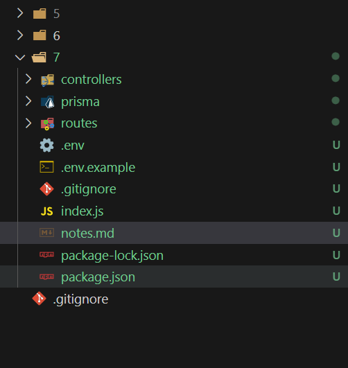
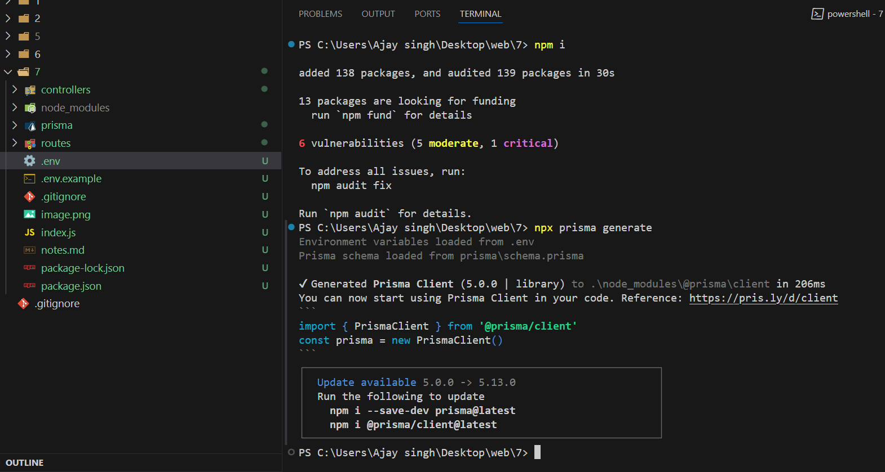
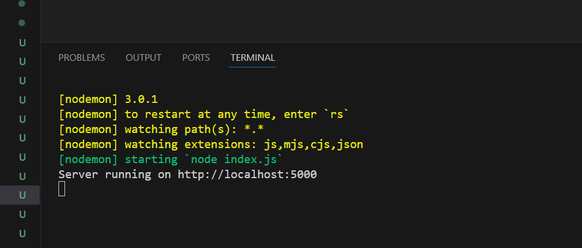
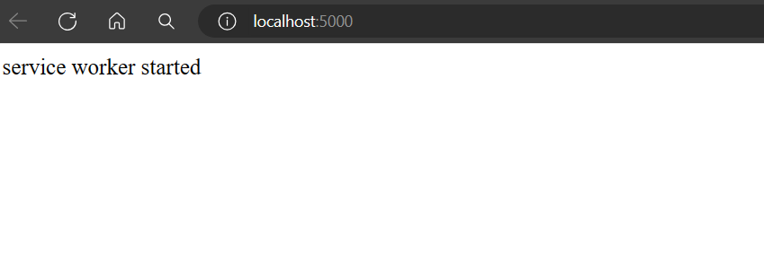

# Web Practical Exam

## Step 1: Clone the Repository
```
git clone https://github.com/ajaysinghpanwar2002/web-practical-exam.git
```

## Step 2: Install Dependencies
Open a dedicated terminal in the project directory and run:
```
npm i
```

## Step 3: Connect to the Database

### Option 1: MongoDB Atlas

1. Log in to MongoDB Atlas.
2. Create a new cluster. 
3. Connect to MongoDB Compass and create a database.
4. Copy the connection URL.
5. Create a `.env` file in the local directory.
6. Copy the contents from `.env.example` and replace the `DATABASE_URL` with the connection URL you copied.



### Option 2: Local MongoDB Setup

1. Open the app and get the URL.
2. Paste the URL in the `.env` file.

## Step 4: Initialize Prisma Database

Whenever you make changes to the `schema.prisma` file, run the following commands:

```
npx prisma generate
npx prisma format
```

Your terminal should look like this on successful execution:



## Step 5: Run the Server

```
npm run dev
```

After running this command, your terminal should look like this:



Click on the URL, and if the webpage looks like this, you're all set:



## Additional Resources

- [Prisma Schema Reference](https://www.prisma.io/docs/reference/api-reference/prisma-schema-reference)